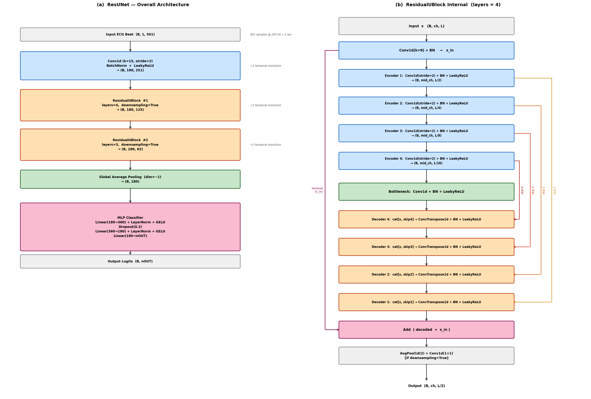

# Wearable ECG DB Classification

Beat-level multi-label arrhythmia classification from **HiCardi wearable ECG** data,
with on-device inference via an Android app powered by ExecuTorch.

> This repository contains source code and configuration only. It does not include
> the HiCardi database, pretrained checkpoints, or generated beat caches.

## Overview

The pipeline classifies ECG beats into **7 arrhythmia classes** using a 1-D ResUNet trained on
HiCardi Holter recordings. After training, the model is exported to ExecuTorch (`.pte`) and
deployed to an Android app for real-time on-device inference.

**7 classes:** Normal / Sinus Tachy / APC / AF/AFL / Bradycardia / VPC / Trigeminy

Key design choices:

- Beat-centric segmentation: 501-sample window (250 pre + center R-peak + 250 post) at 250 Hz
- Multi-label classification with `BCEWithLogitsLoss` (one beat can belong to multiple classes)
- ExecuTorch XNNPACK delegate for efficient mobile inference (no server required)

## Repository Layout

```text
config.py                   global paths and hyperparameters
models.py                   ResUNet model definition
train.py                    training entry point (PyTorch Lightning)
test.py                     checkpoint evaluation on test set
export_mobile.py            .ckpt → ExecuTorch .pte conversion
mat_viewer.py               HiCardi .mat file inspection utility
plot_arch.py                model architecture diagram
plot_beats.py               ECG beat visualization

dataset_generation/
  Hicardi_dataset_generation.py   segment .mat files into beat cache
  Hicardi_label_generation.py     extract multi-hot labels from final_flag

datamodule/
  HiCardiDataModule.py    PyTorch Lightning DataModule (HiCardi)
  MITBIHDataModule.py     PyTorch Lightning DataModule (MIT-BIH, optional)
  utils/                  dataset utilities and beat class definitions

trainer/
  LitECGMultiLabelClassifier.py   Lightning module (multi-label)
  LitECGClassifier.py             Lightning module (single-label, legacy)
  DataEfficientTrainer.py         custom training utilities

data/
  split_01holter.json     train / val / test patient split

android/                  HiCardiMonitor Android app (Kotlin + ExecuTorch)

arch_diagram.png          ResUNet architecture diagram
```

## Installation

```bash
git clone https://github.com/KEunBiII/Wearable_ECG_DB_Classification.git
cd Wearable_ECG_DB_Classification

pip install torch torchaudio lightning scikit-learn numpy scipy
pip install executorch          # required only for export_mobile.py
```

Python 3.10+ and PyTorch 2.x are recommended.

## Dataset Preparation

Obtain the HiCardi database separately and place raw `.mat` files under:

```text
Database/hicardi/
  <patient_id>/
    *.mat
```

Or set the environment variable:

```bash
export HICARDI_ROOT=/path/to/hicardi
```

**Step 1 — Generate beat cache** (segments each recording into 501-sample beat windows):

```bash
python dataset_generation/Hicardi_dataset_generation.py
```

This writes `.npy` beat files and `hicardi_beat_cache_01holter/index.csv`.

**Step 2 — Generate labels** (extracts multi-hot labels from `final_flag` columns):

```bash
python dataset_generation/Hicardi_label_generation.py
```

**Step 3 — Verify the split**

The default train/val/test patient split is at `data/split_01holter.json`.

## Training

```bash
python train.py
python train.py --epochs 50 --lr 1e-3 --batch 256
python train.py --normal_ratio 2.0    # Normal : arrhythmia undersampling = 2:1
```

Checkpoints and TensorBoard logs are written to `results/`.

| Hyperparameter | Default |
|---|---|
| Input length | 501 samples (250 Hz) |
| Model | ResUNet (`out_ch=180`, `mid_ch=30`) |
| Loss | BCEWithLogitsLoss |
| Batch size | 256 |
| Learning rate | 1e-3 |
| Max epochs | 50 |

## Evaluation

```bash
python test.py --ckpt results/<run>/checkpoints/best.ckpt
python test.py --ckpt results/<run>/checkpoints/best.ckpt --exclude_classes Trigeminy APC
```

Reports per-class and macro F1, AUROC, and AUPRC, plus confusion matrices.

## Export to Mobile

Converts a trained Lightning checkpoint to an ExecuTorch `.pte` file:

```bash
python export_mobile.py --ckpt results/<run>/checkpoints/best.ckpt
python export_mobile.py --ckpt results/<run>/checkpoints/best.ckpt --out results/model.pte
python export_mobile.py --ckpt results/<run>/checkpoints/best.ckpt --verify
```

| I/O | Shape | dtype |
|---|---|---|
| Input | `[1, 1, 501]` | float32 (z-score normalized) |
| Output | `[1, 7]` | float32 (raw logits, apply sigmoid) |

The `--verify` flag runs a self-test comparing PyTorch and ExecuTorch outputs on a random input.

## Android App

The `android/` folder contains **HiCardiMonitor**, a Kotlin app that loads `model.pte`
and runs beat-level arrhythmia classification entirely on-device.

- Runtime: ExecuTorch 0.7.0 with XNNPACK delegate (`android/app/libs/executorch.aar`)
- Model file: `android/app/src/main/assets/model.pte`
- Supported ABI: `arm64-v8a` (physical device), `x86_64` (emulator)
- Min SDK: 26

**Build:**

```bash
cd android
./gradlew :app:assembleDebug
# APK → app/build/outputs/apk/debug/app-debug.apk
```

Or open the `android/` folder in Android Studio and click Run.

**Key source files:**

| File | Role |
|---|---|
| `MainActivity.kt` | JSON parsing, beat playback, HR/rhythm display, AI result overlay |
| `EcgClassifier.kt` | Loads `.pte`, runs per-beat sigmoid inference |
| `EcgView.kt` | Custom ECG waveform view |

## Model Architecture



The backbone is a **1-D ResUNet** with U-Net style residual blocks.
Each block performs local downsampling/upsampling to capture multi-scale temporal patterns
in the ECG beat signal.

## Acknowledgement

HiCardi wearable ECG data provided by [HiCardi](https://www.hicardi.com).
ResUNet architecture adapted from U-Net residual designs for 1-D biomedical signals.
Android inference powered by [ExecuTorch](https://pytorch.org/executorch).
